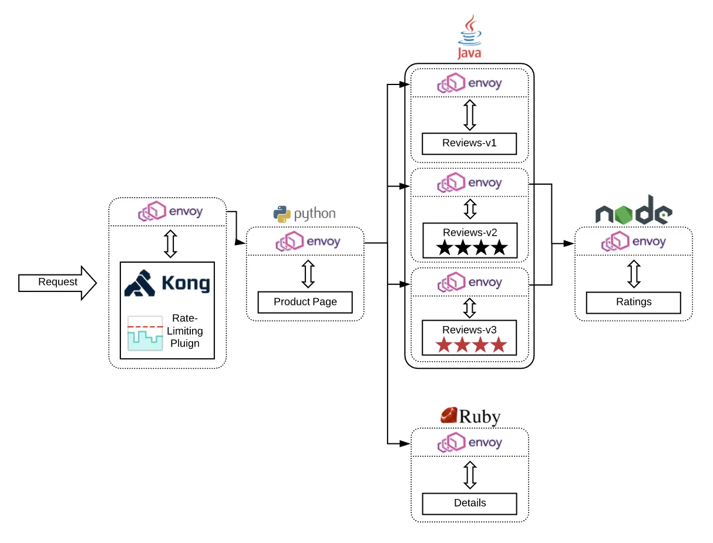

## Resources
- https://grpc.io/
"gRPC is a modern open source high performance Remote Procedure Call (RPC) framework that can run in any environment. It can efficiently connect services in and across data centers with pluggable support for load balancing, tracing, health checking and authentication. It is also applicable in last mile of distributed computing to connect devices, mobile applications and browsers to backend services."

- API gateway is responsibility for external traffic of authentication, caching, compression and rate-limiting.

- service mesh is one of solution to make service to service traffic observability and management without tears.

- Istio is one of service mesh solutions which let service to service communication observability. Istio use side car pattern which let envoy proxy intercept iptable traffic. Side car proxy with higher resource cost and increase latency because of addition hub. You can choose another solution like traefik mesh/kong mesh.

- Envoy is a self contained, high performance server with a small memory footprint. It runs alongside any application language or framework. HTTP/2 and gRPC support. Envoy has first class support for HTTP/2 and gRPC for both incoming and outgoing connections.
- https://www.envoyproxy.io/ - ENVOY IS AN OPEN SOURCE EDGE AND SERVICE PROXY, DESIGNED FOR CLOUD-NATIVE APPLICATIONS
  Originally built at Lyft, Envoy is a high performance C++ distributed proxy designed for single services and applications, as well as a communication bus and “universal data plane” designed for large microservice “service mesh” architectures. Built on the learnings of solutions such as NGINX, HAProxy, hardware load balancers, and cloud load balancers, Envoy runs alongside every application and abstracts the network by providing common features in a platform-agnostic manner. When all service traffic in an infrastructure flows via an Envoy mesh, it becomes easy to visualize problem areas via consistent observability, tune overall performance, and add substrate features in a single place.

- Side car proxy
  https://istio.io/latest/docs/reference/config/networking/sidecar/
  Sidecar describes the configuration of the sidecar proxy that mediates inbound and outbound communication to the workload instance it is attached to. By default, Istio will program all sidecar proxies in the mesh with the necessary configuration required to reach every workload instance in the mesh, as well as accept traffic on all the ports associated with the workload. The Sidecar configuration provides a way to fine tune the set of ports, protocols that the proxy will accept when forwarding traffic to and from the workload. In addition, it is possible to restrict the set of services that the proxy can reach when forwarding outbound traffic from workload instances.

- https://learn.microsoft.com/en-us/azure/architecture/patterns/sidecar
Deploy components of an application into a separate process or container to provide isolation and encapsulation. This pattern can also enable applications to be composed of heterogeneous components and technologies.

This pattern is named Sidecar because it resembles a sidecar attached to a motorcycle. In the pattern, the sidecar is attached to a parent application and provides supporting features for the application. The sidecar also shares the same lifecycle as the parent application, being created and retired alongside the parent. The sidecar pattern is sometimes referred to as the sidekick pattern and is a decomposition pattern.

- https://istiobyexample.dev/grpc/
gRPC is a communication protocol for services, built on HTTP/2. Unlike REST over HTTP/1, which is based on resources, gRPC is based on Service Definitions. You specify service definitions in a format called protocol buffers (“proto”), which can be serialized into an small binary format for transmission.

With gRPC, you can generate boilerplate code from .proto files into multiple programming languages, making gRPC an ideal choice for polyglot microservices.

While gRPC supports some networking use cases like TLS and client-side load balancing, adding Istio to a gRPC architecture can be useful for collecting telemetry, adding traffic rules, and setting RPC-level authorization. Istio can also provide a useful management layer if your traffic is a mix of HTTP, TCP, gRPC, and database protocols, because you can use the same Istio APIs for all traffic types.

Istio and its data plane proxy, Envoy, both support gRPC. Let’s see how to manage gRPC traffic with Istio.

grpc

- https://www.baeldung.com/grpc-introduction

